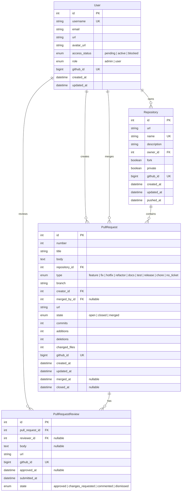
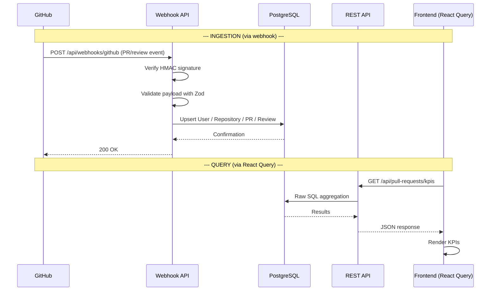

# Module 01: Introduction

## Overview

**PR Review Pulse** is a SaaS platform that enables development teams to monitor and analyze GitHub Pull Request metrics. It connects via GitHub OAuth for authentication and receives real-time events via webhooks to keep data synchronized.

### Key Capabilities

- Real-time synchronization of PRs and reviews via GitHub webhooks
- KPI Dashboard: open PRs, PRs without reviews, approved pending merge, merged
- Time-series charts: daily PR creation/close/merge activity
- PR type distribution: feature, fix, hotfix, refactor, docs, test, release, chore
- Paginated tables with search and filters for PRs, repositories, and users
- Side drawer with PR details and review cards with markdown
- Role-based access control: admin (global) vs user (personal)
- Dark/light/system theme

## Detailed Tech Stack

| Category        | Technology                                   |
| --------------- | -------------------------------------------- |
| Framework       | Next.js 16 (App Router)                      |
| Language        | TypeScript                                   |
| Runtime         | Bun                                          |
| Database        | PostgreSQL 17                                |
| ORM             | Prisma                                       |
| Authentication  | NextAuth.js v4 + GitHub OAuth                |
| Server State    | TanStack React Query v5                      |
| Validation      | Zod                                          |
| UI              | shadcn/ui + Tailwind CSS v4 + Recharts       |
| Linter          | Biome                                        |
| Logger          | Winston (daily rotate file)                  |

## Data Model (ER)



## General Data Flow



## Authentication Flow

```mermaid
flowchart TD
    A[Unauthenticated user] --> B{Navigates to protected route?}
    B -->|Yes| C[Redirect to /login]
    B -->|No| D[Public page: /login]
    C --> D
    D --> E[Click "Sign in with GitHub"]
    E --> F[Redirect to GitHub OAuth]
    F --> G{User authorizes?}
    G -->|No| D
    G -->|Yes| H[NextAuth Callback]
    H --> I[Upsert user in DB]
    I --> J{access_status = active?}
    J -->|Yes| K[Generate JWT + session]
    K --> L[Redirect to / based on role]
    J -->|No| M[Redirect to /access-status]
    L --> N[Admin -> /prs]
    L --> O[User -> /prs/me]
```

## Directory Structure

```
src/
├── app/
│   ├── (authenticated)/   # Protected routes (sidebar layout)
│   │   ├── dashboard/
│   │   ├── prs/
│   │   ├── repositories/
│   │   └── users/
│   ├── (public)/          # Public routes
│   │   ├── login/
│   │   └── access-status/
│   └── api/               # REST API
│       ├── auth/
│       ├── pull-requests/
│       ├── repositories/
│       ├── users/
│       └── webhooks/github/
├── components/            # UI components
│   ├── common/            # Dashboard, badges, drawer
│   ├── providers/         # Session, Theme, Query providers
│   └── ui/                # shadcn/ui + custom
├── constants/             # Config, routes, menu
├── contracts/             # Zod schemas + TS types
├── hooks/                 # Custom hooks
├── lib/                   # Prisma singleton, axios, logger
├── middlewares/           # Session + roles middleware
├── services/              # Frontend services (axios wrappers)
└── utils/                 # Formatters, handlers, utils
```
