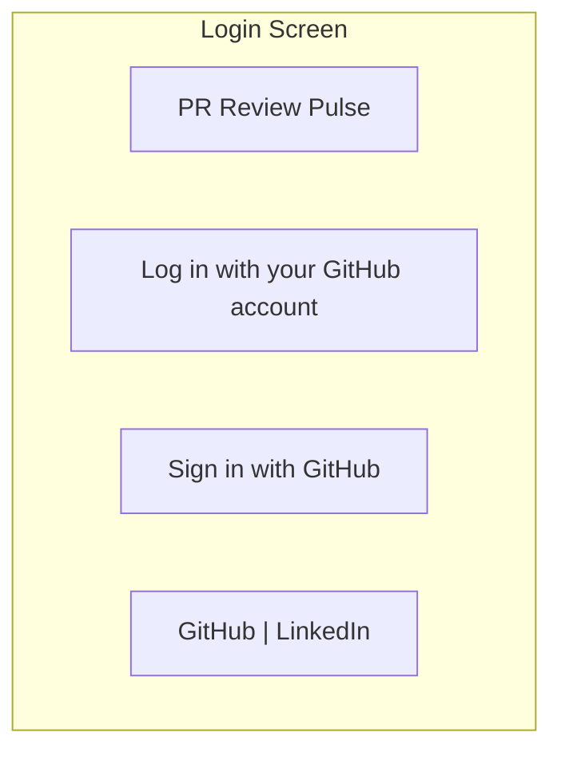
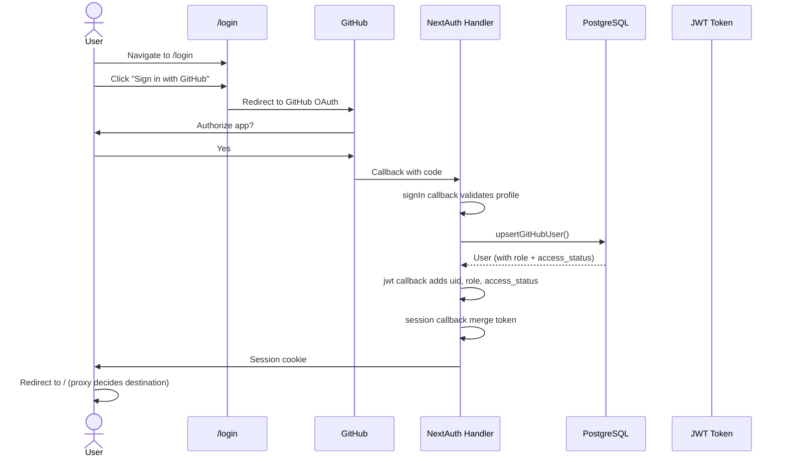
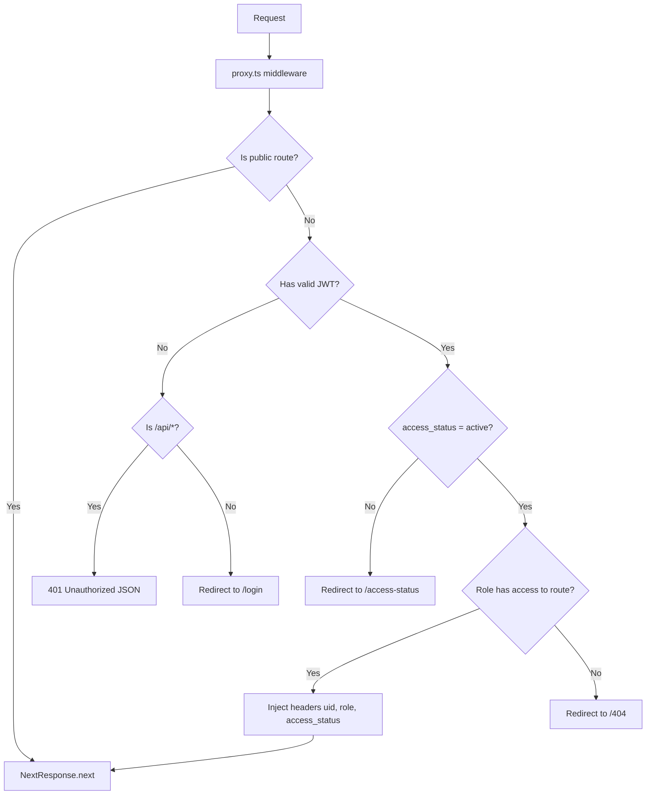
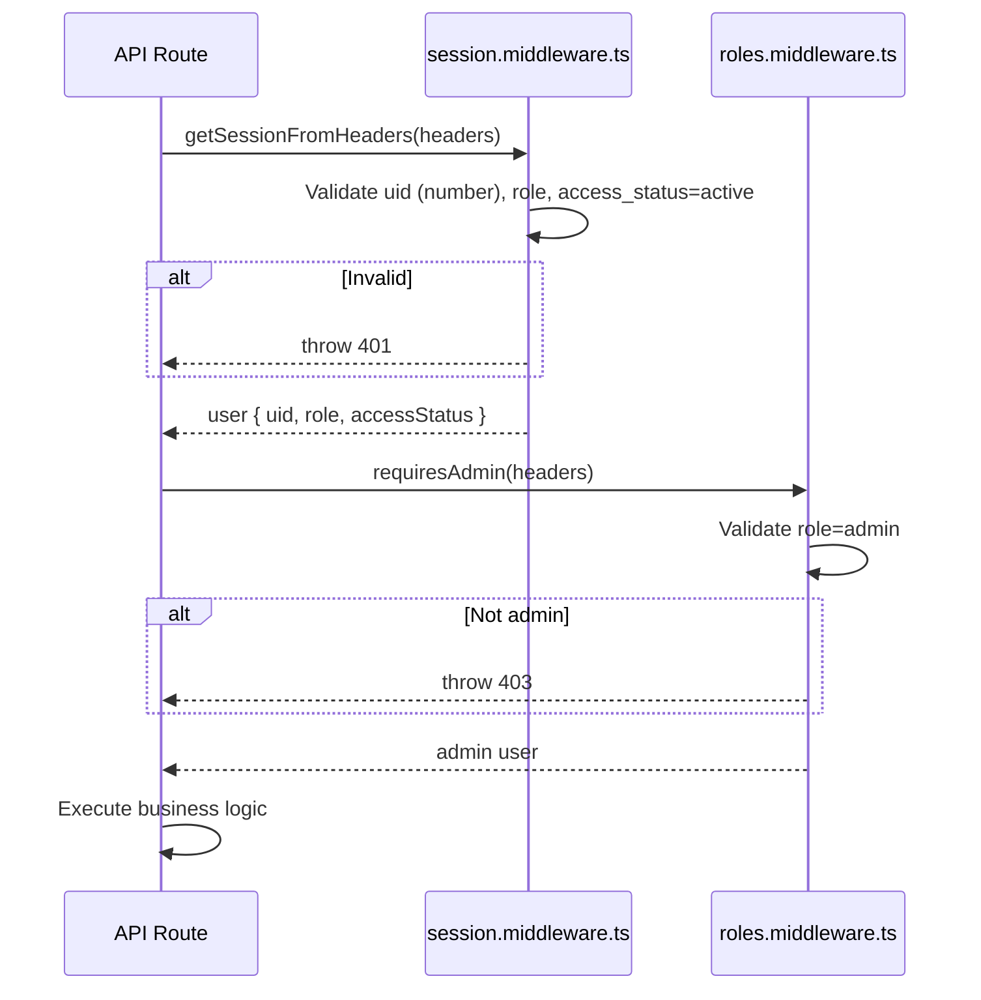

# Module 02: Authentication

## Requirements

### Functional
- Login via GitHub OAuth
- Automatic user registration on first login
- Access control based on status (`pending`, `active`, `blocked`)
- Access control based on role (`admin`, `user`)
- Post-login redirect based on user role
- Logout
- Session persistence via JWT + cookies

### Non-Functional
- Secure session with httpOnly cookies
- API routes return 401/403 without HTML redirect
- Protection middleware applied to all routes

## Users

| Actor     | Description                                   | Permissions                                   |
| --------- | --------------------------------------------- | --------------------------------------------- |
| Visitor   | Unauthenticated user                          | Only `/login`, `/access-status`               |
| Pending   | Authenticated but not approved by an admin    | Only `/access-status`                         |
| Blocked   | Access revoked by an admin                    | Only `/access-status`                         |
| User      | Standard role, authenticated and active       | `/dashboard/me`, `/prs/me`                    |
| Admin     | Administrator role, authenticated and active  | All routes (`/dashboard`, `/prs`, `/users`, `/repositories`) |

## Screens

### Login (`/login`)
- Header with application name
- "Sign in with GitHub" button
- Floating footer with links to GitHub and LinkedIn (author's)
- Background with particle animation (CanvasParticles)

### Access Status (`/access-status`)
Shows user status when not active:
- **Pending**: yellow icon, message "Access Pending — Your access request is pending approval"
- **Blocked**: red icon, message "Access Blocked — Your account has been blocked"
- "Go to login" button that logs out

## Flows

### Login Flow

### Route Protection Flow (Middleware)

### API Session Validation

