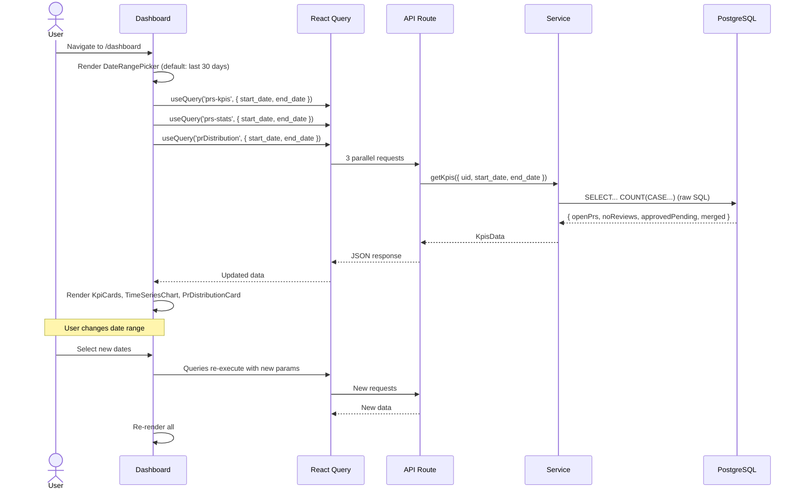
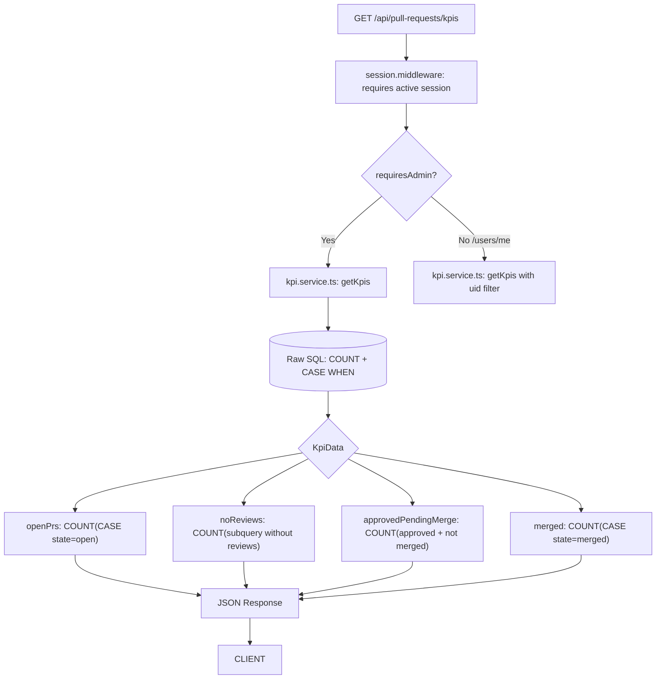

# Module 03: Dashboard

## Requirements

### Functional
- Display PR KPIs in cards: Open PRs, PRs without Reviews, Approved Pending Merge, Merged (last 30 days)
- Display daily activity time-series chart (created, closed, merged)
- Display PR type distribution with percentages (feature, fix, hotfix, etc.)
- Filter by date range (from/to date picker)
- Global view (admin) vs personal view (authenticated user)
- KPIs should update when date range changes

### Non-Functional
- KPI queries use raw SQL for efficiency (aggregations)
- Time-series generated with PostgreSQL's `generate_series` to avoid gaps
- Data is cached with React Query (implicit stale time)

## Users

| Actor   | View          | Screen           | API consumed                                 |
| ------- | ------------- | ---------------- | -------------------------------------------- |
| Admin   | Global        | `/dashboard`     | `/api/pull-requests/kpis`, `/stats`, `/distribution` |
| User    | Personal      | `/dashboard/me`  | `/api/users/me/pull-requests/kpis`, `/stats`, `/distribution` |

## Screens

### Global Dashboard (`/dashboard`)

```
┌─────────────────────────────────────────────┐
│  [Date Range Picker: From █] [To █]         │
├──────────┬──────────┬──────────┬────────────┤
│ 🟢 Open  │ 🟡 No    │ 🔵 Approved│ 🟣 Merged │
│    PRs   │ Reviews  │ Pending   │           │
│    12    │    3     │ Merge · 5 │    8      │
├──────────┴──────────┴──────────┴────────────┤
│ ┌────────────────────────────────────────┐   │
│ │  Time Series Chart (Recharts Line)     │   │
│ │  ─── Created  ─── Closed  ─── Merged   │   │
│ │                                        │   │
│ │  10│    ╱╲                             │   │
│ │   8│   ╱  ╲    ╱╲                      │   │
│ │   6│  ╱    ╲  ╱  ╲    ╱╲               │   │
│ │    │ ╱      ╲╱    ╲  ╱  ╲              │   │
│ │    └─────────────────────────           │   │
│ │     Jun 1     Jun 15     Jun 30         │   │
│ └────────────────────────────────────────┘   │
├──────────────────────────────────────────────┤
│ PR Type Distribution                         │
│                                              │
│ feature  ██████████████████████ 45%          │
│ fix      ████████████ 25%                    │
│ refactor ████████ 15%                        │
│ docs     ████ 8%                             │
│ hotfix   ██ 4%                               │
│ test     █ 3%                                │
│ chore    ▏ 0%                                │
└──────────────────────────────────────────────┘
```

### Personal Dashboard (`/dashboard/me`)

Same structure as global but with data filtered to the authenticated user.

## Components

| Component          | File                                                         | Description                                     |
| ------------------ | ------------------------------------------------------------ | ----------------------------------------------- |
| `DateRangePicker`  | `src/components/ui/custom/date-range-picker.tsx`             | From/To selector with shadcn calendar           |
| `KpiCards`         | `src/components/common/dashboard/kpi-cards.tsx`              | Responsive grid of 4 KpiCard                    |
| `KpiCard`          | `src/components/common/dashboard/kpi-card.tsx`               | Individual card with icon, value, description   |
| `TimeSeriesChart`  | `src/components/common/dashboard/time-series-chart.tsx`      | Recharts LineChart (3 lines)                    |
| `PrDistributionCard` | `src/components/common/dashboard/pr-distribution-card.tsx` | Distribution bars with percentage               |

## Flows

### Dashboard Load Flow



### KPI Query Flow (Backend)



### KPIs

| KPI                    | Description                                                  | SQL                                       |
| ---------------------- | ------------------------------------------------------------ | ----------------------------------------- |
| Open PRs               | PRs in `open` state                                          | `COUNT(CASE WHEN state = 'open')`         |
| PRs without Reviews    | Open PRs without any review                                  | `COUNT(subquery WHERE reviews IS EMPTY)`  |
| Approved Pending Merge | PRs with at least one `approved` review and `open` state     | `COUNT(approved + not merged)`            |
| Merged                 | PRs in `merged` state                                        | `COUNT(CASE WHEN state = 'merged')`       |
