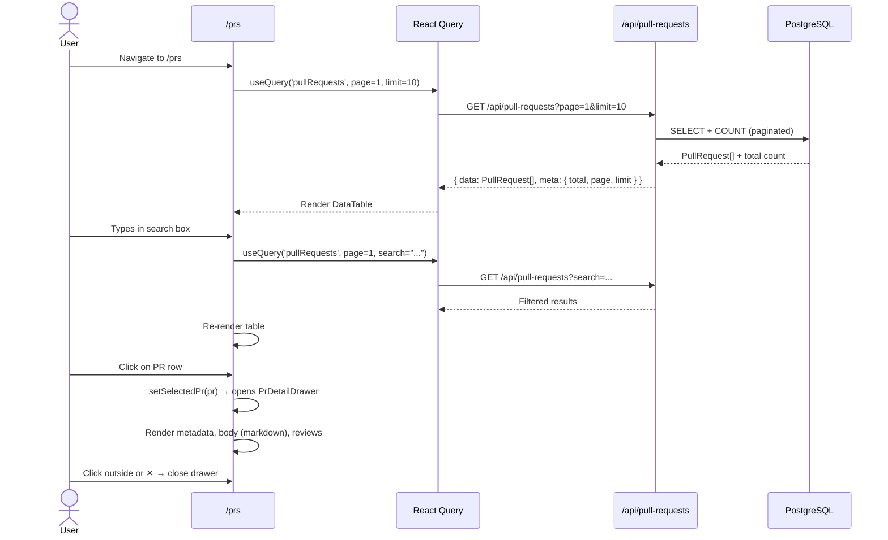
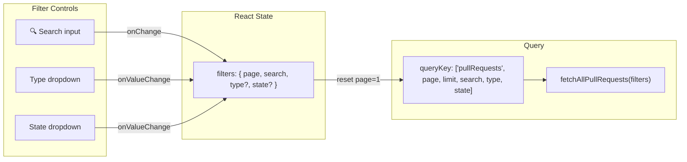
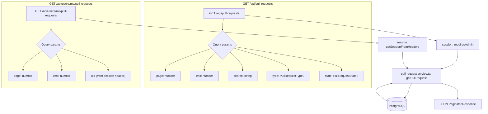

# Module 04: Pull Requests

## Requirements

### Functional
- List PRs in paginated table with columns: title, repo, branch, type, state, creator, date
- Search PRs by repo name, branch, or creator
- Filter by type (`feature`, `fix`, `hotfix`, `refactor`, `docs`, `test`, `release`, `chore`, `no_ticket`)
- Filter by state (`open`, `closed`, `merged`)
- View PR details in side drawer with:
  - Title, number, state and type badges
  - PR body rendered with markdown (GFM, collapsible)
  - Metadata: creator, repo, branch, dates, statistics (commits, +/-, files)
  - List of reviews with reviewer avatar, state, markdown body
- Global view (admin) vs personal view (authenticated user)

### Non-Functional
- Pagination with configurable size (default: 10)
- Search with implicit debounce (input change → reset to page 1)
- Responsive side drawer (sm: 600px, md: 700px, lg: 800px; max 50vw)
- Reviews in FIFO order

## Users

| Actor | View    | Screen    | API consumed                           |
| ----- | ------- | --------- | -------------------------------------- |
| Admin | Global  | `/prs`    | `/api/pull-requests`                   |
| User  | Personal | `/prs/me` | `/api/users/me/pull-requests`          |

## Screens

### PR Listing (`/prs`)

```
┌─────────────────────────────────────────────────────────────┐
│ 🔍 [Search by repository name, branch or creator...]        │
│ [Type: All types ▾] [State: All states ▾]                   │
├─────────────────────────────────────────────────────────────┤
│ ┌─────────────────────────────────────────────────────────┐ │
│ │ PR #123  │ repo-a  │ main     │ feature │ 🟢 Open  │ 2d │ │
│ │ PR #122  │ repo-b  │ fix/..   │ fix     │ 🔴 Closed│ 1d │ │
│ │ PR #121  │ repo-a  │ hotfix/  │ hotfix  │ 🟣 Merged│ 3h │ │
│ │ ...      │         │          │         │          │     │ │
│ └─────────────────────────────────────────────────────────┘ │
│ ◀ 1 2 3 ... 10 ▶                                           │
└─────────────────────────────────────────────────────────────┘

  Click on a row → opens PrDetailDrawer (right side)
```

### PR Detail (Drawer)

```
┌─────────────────────────────────────────┐
│ ✕                                       │
│ ┌─────────────────────────────────────┐ │
│ │ PR Title #123           🟢 Open     │ │
│ │                                      │ │
│ │ ┌─────────────────────────────────┐ │ │
│ │ │ Markdown body (collapsible if   │ │ │
│ │ │ too long)                       │ │ │
│ │ └─────────────────────────────────┘ │ │
│ │                                      │ │
│ │ Creator: @user1     Repo: repo-a    │ │
│ │ Branch: main        Type: feature   │ │
│ │ Created: 2026-06-05 │ Updated: ...  │ │
│ │ Commits: 5 │ +120 │ -30 │ 8 files  │ │
│ │                                      │ │
│ │ Reviews (2)                          │ │
│ │ ┌─────────────────────────────────┐ │ │
│ │ │ ✅ Approved                     │ │ │
│ │ │ @reviewer1 · 2h ago            │ │ │
│ │ │ Looks good to me!              │ │ │
│ │ └─────────────────────────────────┘ │ │
│ │ ┌─────────────────────────────────┐ │ │
│ │ │ 💬 Commented                    │ │ │
│ │ │ @reviewer2 · 1h ago            │ │ │
│ │ │ Maybe check the edge case...   │ │ │
│ │ └─────────────────────────────────┘ │ │
│ └─────────────────────────────────────┘ │
└─────────────────────────────────────────┘
```

## Components

| Component            | File                                                                | Description                                        |
| -------------------- | ------------------------------------------------------------------- | -------------------------------------------------- |
| `DataTable`          | `src/components/ui/custom/data-table.tsx`                           | Generic paginated table with skeleton, expandable  |
| `Pagination`         | `src/components/ui/custom/pagination.tsx`                           | First/Prev/Next/Last controls                      |
| `PrDetailDrawer`     | `src/components/common/pr-detail-drawer/pr-detail-drawer.tsx`       | Side sheet with complete PR details                |
| `PrMetadata`         | `src/components/common/pr-detail-drawer/pr-metadata.tsx`            | PR metadata grid                                   |
| `PrReviewCard`       | `src/components/common/pr-detail-drawer/pr-review-card.tsx`         | Individual review card with markdown               |
| `PrReviewCardLayout` | `src/components/common/pr-detail-drawer/pr-review-card-layout.tsx`  | Layout with color based on review state            |
| `PrStateBadge`       | `src/components/common/badges/pr-state-badge.tsx`                   | Badge: Open (green), Closed (red), Merged (purple) |
| `PrTypeBadge`        | `src/components/common/badges/pr-type-badge.tsx`                    | PR type badge with category color                  |
| `MarkdownViewer`     | `src/components/common/markdown-viewer.tsx`                         | ReactMarkdown with GFM + collapsible               |
| `BranchColumn`       | `src/app/(authenticated)/prs/_components/columns/branch-column.tsx` | Branch column with git icon                        |
| `RepositoryColumn`   | `src/app/(authenticated)/prs/_components/columns/repository-column.tsx` | Repo column with colored badge               |

## Flows

### Navigation Flow: List → Detail



### Filter Flow



### Pull Requests API (Backend)



### Table Columns

| Column      | Admin (`/prs`)                                                   | User (`/prs/me`)                                                      |
| ----------- | ---------------------------------------------------------------- | --------------------------------------------------------------------- |
| Title       | `#number` + title + PrStateBadge + PrTypeBadge                   | `#number` + title + PrStateBadge + PrTypeBadge                        |
| Repository  | Colored badge with repo name                                     | Colored badge with repo name                                          |
| Branch      | Branch name with git icon                                        | Branch name with git icon                                             |
| Type        | PrTypeBadge                                                      | PrTypeBadge                                                           |
| State       | PrStateBadge                                                     | PrStateBadge                                                          |
| Creator     | Avatar + username (UserColumn)                                   | Avatar + username (UserColumn)                                        |
| Reviews     | N/A                                                              | N/A                                                                   |
| Created     | Relative formatted date (N days ago)                             | Relative formatted date                                               |
