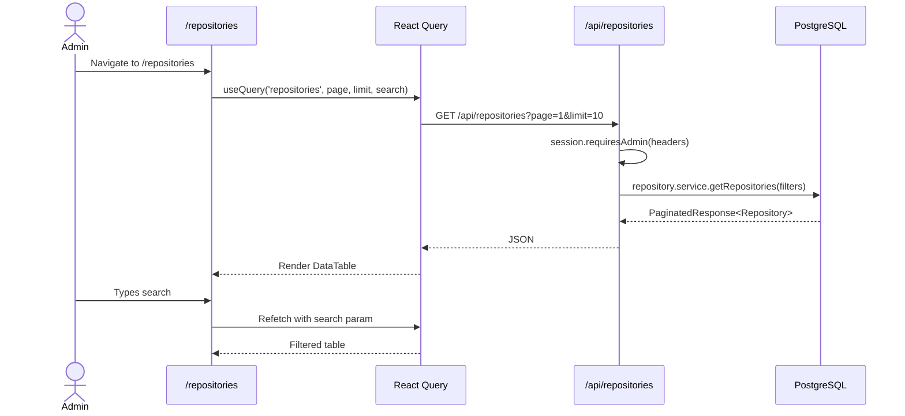

# Module 05: Repositories

## Requirements

### Functional
- List synced repositories in paginated table
- Search repositories by name
- Show name, description, owner, visibility (public/private), creation date
- Show PR count associated with each repository
- Repositories are created automatically via webhooks (no manual CRUD)

### Non-Functional
- Read-only table (automatic synchronization)
- Pagination with configurable size (default: 10)
- Data obtained from GitHub via webhook, not editable in the app

## Users

| Actor | Permissions                            | Screen            |
| ----- | -------------------------------------- | ----------------- |
| Admin | View all repositories                  | `/repositories`   |
| User  | No access (admin role only)            | —                 |

## Screens

### Repository Listing (`/repositories`)

```
┌─────────────────────────────────────────────────────────────┐
│ 🔍 [Search by repository name...]                           │
├─────────────────────────────────────────────────────────────┤
│ ┌─────────────────────────────────────────────────────────┐ │
│ │ repo-a  │ Awesome project     │ @user1  │ 12 PRs │ 2026 │ │
│ │ repo-b  │ CLI tool            │ @user2  │ 5 PRs  │ 2026 │ │
│ │ repo-c  │ Web app             │ @user1  │ 23 PRs │ 2025 │ │
│ │ ...     │                     │         │        │      │ │
│ └─────────────────────────────────────────────────────────┘ │
│ ◀ 1 2 3 ▶                                                  │
└─────────────────────────────────────────────────────────────┘
```

## Components

| Component               | File                                                                     | Description                                  |
| ----------------------- | ------------------------------------------------------------------------ | -------------------------------------------- |
| `DataTable`             | `src/components/ui/custom/data-table.tsx`                                | Generic paginated table                      |
| `UserColumn`            | `src/components/common/columns/user-column.tsx`                          | Owner avatar + username                      |
| `getRepositoryColumns`  | `src/app/(authenticated)/repositories/_components/repositories-columns.tsx` | Table column definitions                 |

## Flows

### Synchronization Flow

Repositories are not created manually. They are automatically synced when GitHub sends a webhook:

```mermaid
flowchart LR
    GH[GitHub Event] --> WH[Webhook API]
    WH --> UPSERT["upsertRepository()"]
    UPSERT --> UPD{Already exists?}
    UPD -->|Yes: github_id exists| UPDATE[UPDATE name, url, description...]
    UPD -->|No| CREATE[INSERT new repository]
    CREATE --> DB[(PostgreSQL)]
    UPDATE --> DB
    DB --> UI[/repositories]
```

### Query Flow



## API

| Method | Route              | Auth    | Description                    |
| ------ | ------------------ | ------- | ------------------------------ |
| GET    | `/api/repositories` | Admin   | Paginated list of repositories |

### Query Parameters

| Parameter | Type   | Default | Description               |
| --------- | ------ | ------- | ------------------------- |
| `page`    | number | 1       | Page number               |
| `limit`   | number | 10      | Page size                 |
| `search`  | string | —       | Search by name            |

### Table Columns

| Column     | Description                        |
| ---------- | ---------------------------------- |
| Name       | Repository name                    |
| Owner      | Owner avatar + username            |
| PRs        | PR count (`_count.pull_requests`)  |
| Visibility | Public or private                  |
| Created    | Repository creation date           |
