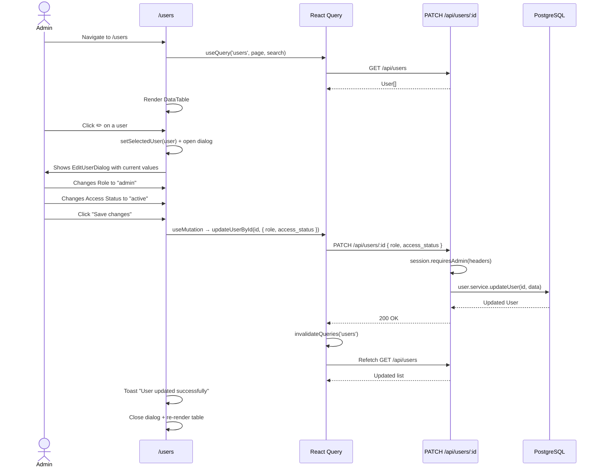
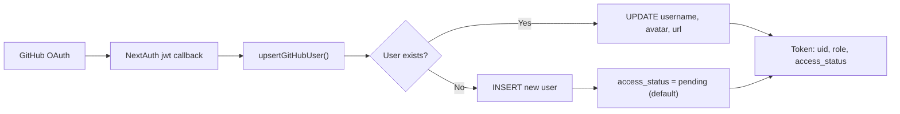

# Module 06: Users

## Requirements

### Functional
- List users in paginated table with search by username
- View: username, email, avatar, role, access status, registration date
- Edit user role (`admin` | `user`)
- Edit access status (`pending` | `active` | `blocked`)
- Users are created automatically on GitHub login (upsert)
- No manual registration or deletion of users from the app

### Non-Functional
- Only accessible by administrators
- Mutations automatically invalidate React Query cache
- Toast confirmation on user edit

## Users

| Actor   | Permissions                                           | Screen      |
| ------- | ----------------------------------------------------- | ----------- |
| Admin   | View and edit all users                               | `/users`    |
| User    | No access to module (administration only)             | —           |

## Screens

### User Listing (`/users`)

```
┌─────────────────────────────────────────────────────────────┐
│ 🔍 [Search by username...]                                  │
├─────────────────────────────────────────────────────────────┤
│ ┌─────────────────────────────────────────────────────────┐ │
│ │ @user1   │ user1@mail.com │ Admin  │ 🟢 Active  │ 2026 │ │
│ │ @user2   │ user2@mail.com │ User   │ 🟡 Pending │ 2026 │ │
│ │ @user3   │ —              │ User   │ 🔴 Blocked │ 2026 │ │
│ │ ...      │                │        │           │      │ │
│ └─────────────────────────────────────────────────────────┘ │
│ ◀ 1 2 3 ▶                                                  │
└─────────────────────────────────────────────────────────────┘
  Click on ✏️ → opens EditUserDialog
```

### Edit Dialog (`EditUserDialog`)

```
┌─────────────────────────────────────────┐
│ Edit User                               │
│ Update role and access status for user1 │
│                                         │
│ Role:        [User ▾]                   │
│              • User                     │
│              • Admin                    │
│                                         │
│ Access:      [Active ▾]                 │
│              • Pending                  │
│              • Active                   │
│              • Blocked                  │
│                                         │
│         [Cancel]  [Save changes]        │
└─────────────────────────────────────────┘
```

## Components

| Component          | File                                                          | Description                                       |
| ------------------ | ------------------------------------------------------------- | ------------------------------------------------- |
| `DataTable`        | `src/components/ui/custom/data-table.tsx`                     | Generic paginated table                           |
| `UserColumn`       | `src/components/common/columns/user-column.tsx`               | Avatar + username                                 |
| `getUserColumns`   | `src/app/(authenticated)/users/_components/users-columns.tsx` | Column definitions with edit button               |
| `EditUserDialog`   | `src/app/(authenticated)/users/_components/edit-user-dialog.tsx` | Dialog for editing role and access status     |

## Flows

### User Edit Flow



### User Creation Flow (Login)



## API

| Method | Route            | Auth  | Description                  |
| ------ | ---------------- | ----- | ---------------------------- |
| GET    | `/api/users`     | Admin | Paginated list of users      |
| GET    | `/api/users/:id` | Admin | Get user by ID               |
| PATCH  | `/api/users/:id` | Admin | Update role and/or status    |

### PATCH `/api/users/:id` Parameters

```json
{
  "role": "admin" | "user",
  "access_status": "pending" | "active" | "blocked"
}
```

### Table Columns

| Column        | Description                        |
| ------------- | ---------------------------------- |
| Avatar        | User avatar                        |
| Username      | Username with link to GH           |
| Email         | Email address                      |
| Role          | Badge: Admin or User               |
| Access Status | Colored badge: Active/Pending/Blocked |
| Created       | Registration date                  |
| Actions       | ✏️ button to edit                  |

## Access Statuses

| Status    | Meaning                                      | Icon |
| --------- | -------------------------------------------- | ---- |
| `pending` | User registered, awaiting approval           | 🟡   |
| `active`  | User approved, can use the application       | 🟢   |
| `blocked` | User blocked by administrator                | 🔴   |
