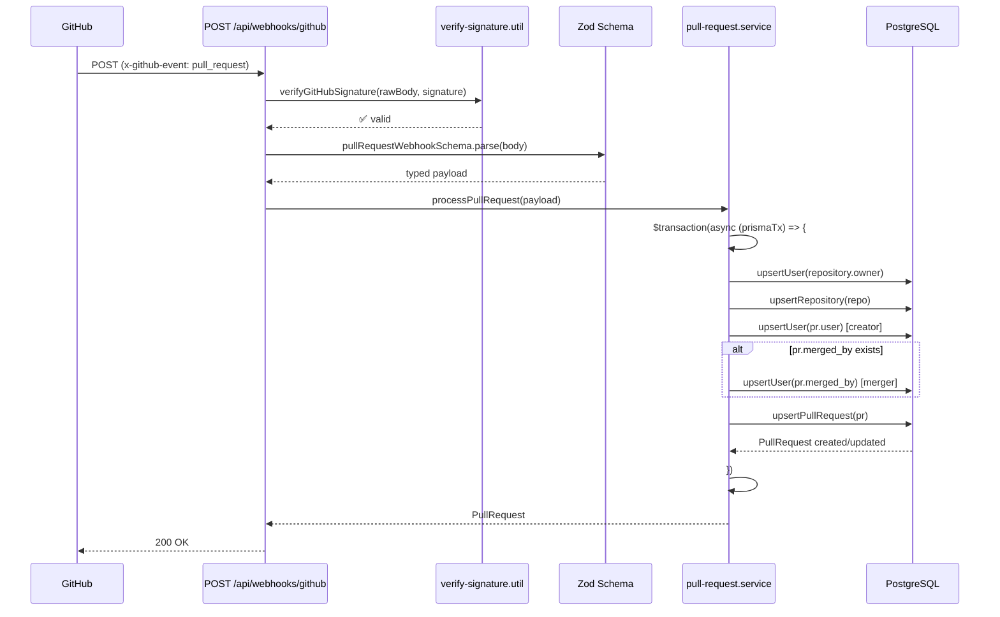
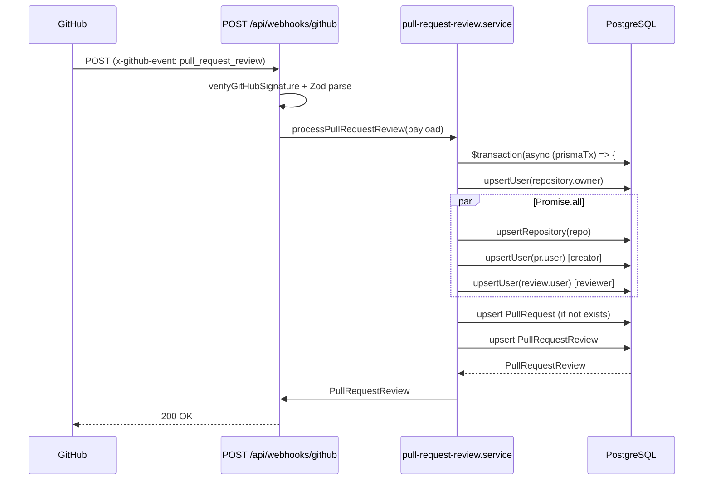
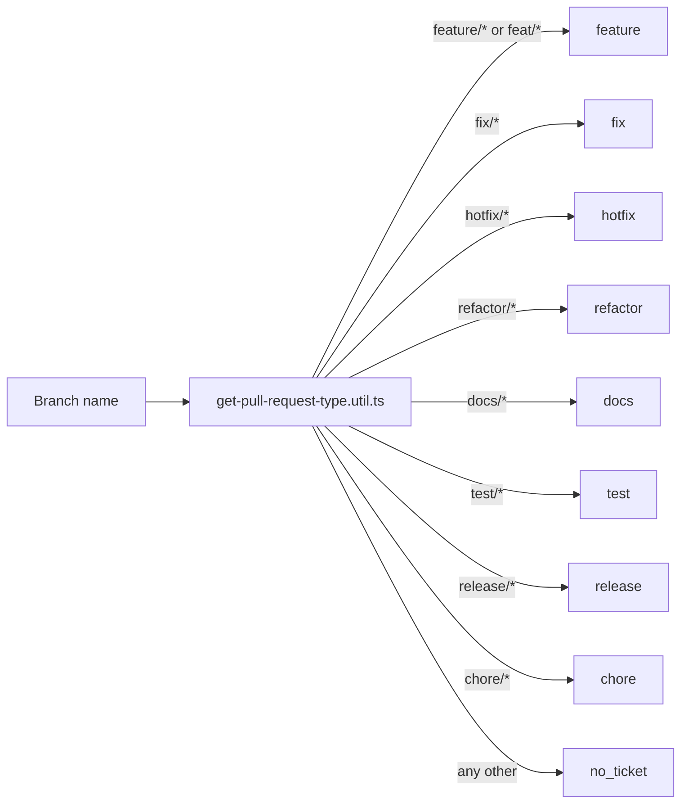
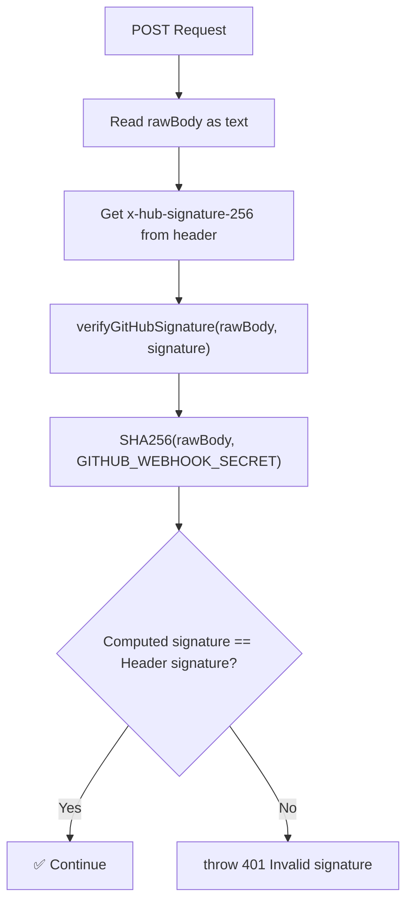

# Module 07: Webhooks

## Requirements

### Functional
- Receive Pull Request events from GitHub (opened, closed, reopened, edited, etc.)
- Receive Pull Request Review events from GitHub (submitted, edited, dismissed)
- Automatically sync: users, repositories, PRs and reviews in PostgreSQL
- Detect PR type based on branch name (feature/, fix/, hotfix/, etc.)
- Support only `PullRequest` and `PullRequestReview` events
- Return 200 for unsupported events (don't break GitHub integration)

### Non-Functional
- HMAC-SHA256 signature verification for security
- Operations within Prisma transactions (`$transaction`) for consistency
- Transaction timeout: 15s execution, 20s max wait
- Idempotency: all upserts use `github_id` as unique key

## Users

| Actor         | Description                             | Interaction                        |
| ------------- | --------------------------------------- | ---------------------------------- |
| GitHub        | Service that sends webhooks             | POST with JSON payload + signature |
| Administrator | Configures webhook in GitHub            | Initial configuration only         |

There is no user interface for this module — it is purely backend.

## Flows

### Pull Request Event Ingestion Flow



### Pull Request Review Event Ingestion Flow



### Branch → PR Type Mapping



## Supported Events

### PullRequest (`x-github-event: pull_request`)

| Action              | Processed? | Behavior                                                    |
| ------------------- | ---------- | ----------------------------------------------------------- |
| `opened`            | ✅ Yes     | Creates PR with state=open                                  |
| `closed` (merged)   | ✅ Yes     | Updates state=merged, merged_at, merged_by                  |
| `closed` (no merge) | ✅ Yes     | Updates state=closed, closed_at                             |
| `reopened`          | ✅ Yes     | Updates state=open, clears closed_at and merged_at          |
| `edited`            | ✅ Yes     | Updates title, body, branch                                 |
| `synchronize`       | ✅ Yes     | Updates commits, additions, deletions, changed_files        |

### PullRequestReview (`x-github-event: pull_request_review`)

| State                | Processed? | Behavior                                             |
| -------------------- | ---------- | ---------------------------------------------------- |
| `approved`           | ✅ Yes     | Creates review with state=approved, approved_at=submitted_at |
| `changes_requested`  | ✅ Yes     | Creates review with state=changes_requested          |
| `commented`          | ✅ Yes     | Creates review with state=commented                  |
| `dismissed`          | ✅ Yes     | Creates review with state=dismissed                  |

## API

| Method | Route                  | Auth                    | Description                        |
| ------ | ---------------------- | ----------------------- | ---------------------------------- |
| POST   | `/api/webhooks/github` | HMAC-SHA256 signature   | GitHub webhook receiver            |

### Signature Verification



### Example Payload (PullRequest Opened)

```json
{
  "action": "opened",
  "pull_request": {
    "id": 1234567890,
    "number": 42,
    "title": "Add new feature",
    "body": "## Summary\nThis PR adds...",
    "state": "open",
    "head": { "ref": "feature/awesome" },
    "user": { "id": 111, "login": "devuser", "avatar_url": "...", "html_url": "..." },
    "merged": false,
    "commits": 5,
    "additions": 120,
    "deletions": 30,
    "changed_files": 8,
    "created_at": "2026-06-07T10:00:00Z"
  },
  "repository": {
    "id": 987654321,
    "name": "my-repo",
    "html_url": "https://github.com/org/my-repo",
    "owner": { "id": 111, "login": "devuser", "avatar_url": "...", "html_url": "..." }
  }
}
```

## Zod Schemas

| Schema                            | File                                                                              | Description                    |
| --------------------------------- | --------------------------------------------------------------------------------- | ------------------------------ |
| `pullRequestWebhookSchema`        | `src/app/api/webhooks/github/_contracts/schemas/pull-request-webhook.schema.ts`   | Validates PR payload           |
| `pullRequestReviewWebhookSchema`  | `src/app/api/webhooks/github/_contracts/schemas/pull-request-review-webhook.schema.ts` | Validates review payload   |

## Technical Considerations

- **Idempotency**: All upserts use `github_id` as unique key → the same event can be received multiple times without duplicating data
- **Transactions**: Each webhook is processed within `$transaction` → if one step fails, everything is rolled back
- **Creator vs Reviewer vs Owner**: The same GitHub user can have different roles in different events (repo owner, PR creator, reviewer); the webhook treats them as the same user record thanks to upsert by `github_id`
